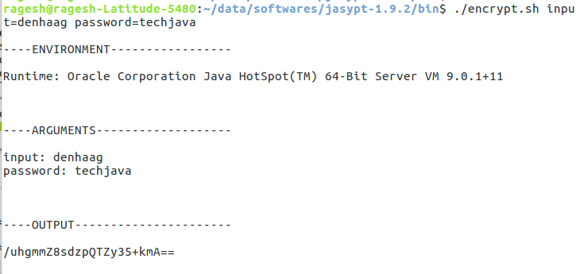

# Springboot Jasypt Encrypt Demo #

This is the spring boot application wich shows how to encrypt value using Jasypt.

- https://mail.codejava.net/frameworks/spring-boot/spring-boot-password-encryption


### About Jasypt ###

* Jasypt provides you with easy unidirectional (digest) and bidirectional encryption techniques.
* Open API for use with any JCE provider, and not only the default Java VM one. Jasypt can be easily used with well-known providers like Bouncy Castle. Learn more.
* Higher security for your users' passwords. Learn more.
* Binary encryption support. Jasypt allows the digest and encryption of binaries (byte arrays). Encrypt your objects or files when needed (for being sent over the net, for example).
* Number encryption support. Besides texts and binaries, it allows the digest and encryption of numeric values (BigInteger and BigDecimal, other numeric types are supported when encrypting for Hibernate persistence). Learn more.
* Completely thread-safe.
* Support for encryptor/digester pooling, in order to achieve high performance in multi-processor/multi-core systems.
* Includes a lightweight ("lite") version of the library for better manageability in size-restrictive environments like mobile platforms.
* Provides both easy, no-configuration encryption tools for users new to encryption, and also highly configurable standard encryption tools, for power-users.
* Hibernate 3 and 4 optional integration for persisting fields of your mapped entities in an encrypted manner. Encryption of fields is defined in the Hibernate mapping files, and it remains transparent for the rest of the application (useful for sensitive personal data, databases with many read-enabled users...). Encrypt texts, binaries, numbers, booleans, dates
* Seamlessly integrable into a Spring application, with specific integration features for Spring 2, Spring 3.0 and Spring 3.1. All the digesters and encryptors in jasypt are designed to be easily used (instantiated, dependency-injected...) from Spring. And, because of their being thread-safe, they can be used without synchronization worries in a singleton-oriented environment like Spring. Learn more: Spring 2, Spring 3.0, Spring 3.1.
* Spring Security (formerly Acegi Security) optional integration for performing password encryption and matching tasks for the security framework, improving the security of your users' passwords by using safer password encryption mechanisms and providing you with a higher degree of configuration and control.
* Provides easy to use CLI (Command Line Interface) tools to allow developers initialise their encrypted data and include encryption/decryption/digest operations in maintenance tasks or scripts. Learn more.
* Integrates into Apache Wicket, for more robust encryption of URLs in your secure applications.
* Comprehensive guides and javadoc documentation, to allow developers to better understand what they are really doing to their data.

### Maven Dependencies ###

```
		<dependency>
			<groupId>com.github.ulisesbocchio</groupId>
			<artifactId>jasypt-spring-boot-starter</artifactId>
			<version>1.16</version>
		</dependency>
```

### application.properties (example) ###

```
userdemo.name=ENC(HMooMwK7DCvB778KN1SLWXfTkmis1SpG)
jasypt.encryptor.algorithm=PBEWithMD5AndDES
jasypt.encryptor.password=techjava
usercity.name=ENC(/uhgmmZ8sdzpQTZy35+kmA==)
```

### Generate encrypt value ###

* Download jasypt from the link http://www.jasypt.org/download.html
* Extract the zip file and go to bin folder.
* You can see exe files under bin folder.
* Run the below command
```
./encrypt.sh input=techuser password=techjava

```
### Screenshots ###



### Happy Coding ###
